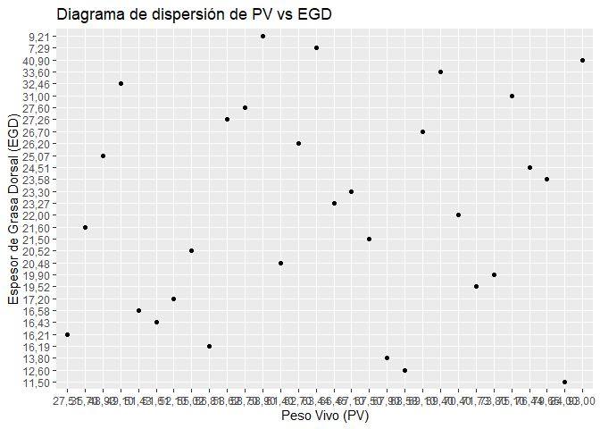

Untitled
================

## Ejercicio 1.1.

En el archivo grasacerdos.xlsx se encuentran los datos del peso vivo
(PV, en Kg) y al espesor de grasa dorsal (EGD, en mm) de 30 lechones
elegidos al azar de una población de porcinos Duroc Jersey del Oeste de
la provincia de Buenos Aires. Se pide (a) Dibujar el diagrama de
dispersión e interpretarlo. (b) Calcular el coeficiente de correlación
muestral y explíquelo. (c) ¿Hay suficiente evidencia para admitir
asociación entre el peso y el espesor de grasa? (α = 0,05). Verifique
los supuestos para decidir el indicador que va a utilizar.

``` r
#incluir librerias
library(readxl)
library(ggplot2)
```

``` r
# Leer los datos del archivo Excel
datos <- read_excel("C:/Repos/Reg_Av/datasets/grasacerdos.xlsx")
```

``` r
# Dibujar el diagrama de dispersión
ggplot(datos, aes(x=PV, y=EGD)) +
  geom_point() +
  labs(title="Diagrama de dispersión de PV vs EGD", x="Peso Vivo (PV)", y="Espesor de Grasa Dorsal (EGD)")
```

<!-- -->

### Interpretando en el diagrama de dispersión

No se observa una relación entre el peso vivo y el espesor de grasa
dorsal.

## Analisis de correlación

``` r
# Verificar el tipo de datos
str(datos$PV)
```

    ##  chr [1:30] "56,81" "70,40" "71,73" "75,10" "79,65" "51,43" "52,10" "69,10" ...

``` r
str(datos$EGD)
```

    ##  chr [1:30] "16,19" "22,00" "19,52" "31,00" "23,58" "16,58" "17,20" "26,70" ...

``` r
# Reemplazar comas por puntos y convertir a numérico
datos$PV <- as.numeric(gsub(",", ".", datos$PV))
datos$EGD <- as.numeric(gsub(",", ".", datos$EGD))
```

``` r
# Verificar el tipo de datos nuevamente
str(datos$PV)
```

    ##  num [1:30] 56.8 70.4 71.7 75.1 79.7 ...

``` r
str(datos$EGD)
```

    ##  num [1:30] 16.2 22 19.5 31 23.6 ...

``` r
# Calcular el coeficiente de correlación muestral
correlacion <- cor(datos$PV, datos$EGD)
correlacion
```

    ## [1] 0.2543434

### Interpretando el coeficiente de correlación

En este caso, un coeficiente de correlación muestral de 0.2543434 entre
el peso vivo y el espesor de grasa dorsal sugiere una correlación
positiva débil entre estas dos variables. Esto significa que a medida
que una variable aumenta, la otra tiende a aumentar, pero la relación no
es muy fuerte.
