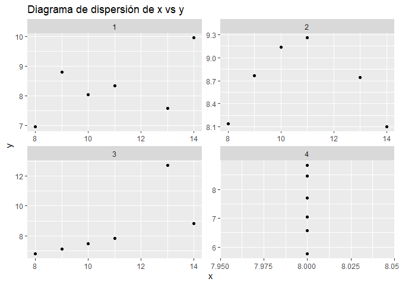

Ejercicio 1.2.
================

## Ejercicio 1.2.

Los datos del cuarteto de Anscombe se encuentran en el archivo
anscombe.xlsx Se pide explorar los datos de la siguiente manera: (a)
Graficar los cuatro pares de datos en un diagrama de dispersión cada
uno. (b) Hallar los valores medios de las variables para cada par de
datos. (c) Hallar los valores de la dispersión para cada conjunto de
datos. (d) Hallar el coeficiente muestral de correlación lineal en cada
caso. (e) Observar, comentar y concluir.

``` r
#incluir librerias
library(readxl)
library(ggplot2)
library(tidyverse)
```

    ## ── Attaching core tidyverse packages ──────────────────────── tidyverse 2.0.0 ──
    ## ✔ dplyr     1.1.2     ✔ readr     2.1.5
    ## ✔ forcats   1.0.0     ✔ stringr   1.5.1
    ## ✔ lubridate 1.9.3     ✔ tibble    3.2.1
    ## ✔ purrr     1.0.1     ✔ tidyr     1.3.1
    ## ── Conflicts ────────────────────────────────────────── tidyverse_conflicts() ──
    ## ✖ dplyr::filter() masks stats::filter()
    ## ✖ dplyr::lag()    masks stats::lag()
    ## ℹ Use the conflicted package (<http://conflicted.r-lib.org/>) to force all conflicts to become errors

``` r
# Leer los datos del archivo Excel
datos <- read_excel("C:/Repos/Reg_Av/datasets/anscombe.xlsx")
```

``` r
# Mostrar los datos
head(datos)
```

    ## # A tibble: 6 × 8
    ##      x1    x2    x3    x4    y1    y2    y3    y4
    ##   <dbl> <dbl> <dbl> <dbl> <dbl> <dbl> <dbl> <dbl>
    ## 1    10    10    10     8  8.04  9.14  7.46  6.58
    ## 2     8     8     8     8  6.95  8.14  6.77  5.76
    ## 3    13    13    13     8  7.58  8.74 12.7   7.71
    ## 4     9     9     9     8  8.81  8.77  7.11  8.84
    ## 5    11    11    11     8  8.33  9.26  7.81  8.47
    ## 6    14    14    14     8  9.96  8.1   8.84  7.04

# (a) Graficar los cuatro pares de datos en un diagrama de dispersión cada uno.

``` r
# Reestructurar los datos a formato largo
datos_largos <- datos %>% pivot_longer(
  cols = c(x1:y4),
  names_to = c(".value", "par"),
  names_pattern = "(x|y)(.)"
)

# Graficar los cuatro pares de datos en un diagrama de dispersión cada uno
ggplot(datos_largos, aes(x = x, y = y)) +
  geom_point() +
  facet_wrap(~par, scales = "free") +
  ggtitle("Diagrama de dispersión de x vs y")
```

<!-- -->

# (b) Hallar los valores medios de las variables para cada par de datos.

``` r
medias <- data.frame(
  x1 = mean(datos$x1),
  y1 = mean(datos$y1),
  x2 = mean(datos$x2),
  y2 = mean(datos$y2),
  x3 = mean(datos$x3),
  y3 = mean(datos$y3),
  x4 = mean(datos$x4),
  y4 = mean(datos$y4)
)
medias
```

    ##         x1       y1       x2       y2       x3    y3 x4  y4
    ## 1 10.83333 8.278333 10.83333 8.691667 10.83333 8.455  8 7.4

# (c) Hallar los valores de la dispersión para cada conjunto de datos.

``` r
# Hallar los valores de la dispersión para cada conjunto de datos
dispersion <- data.frame(
  x1 = sd(datos$x1),
  y1 = sd(datos$y1),
  x2 = sd(datos$x2),
  y2 = sd(datos$y2),
  x3 = sd(datos$x3),
  y3 = sd(datos$y3),
  x4 = sd(datos$x4),
  y4 = sd(datos$y4)
)   
dispersion
```

    ##         x1       y1       x2        y2       x3       y3 x4       y4
    ## 1 2.316607 1.041372 2.316607 0.4872132 2.316607 2.216472  0 1.166722

# (d) Hallar el coeficiente muestral de correlación lineal en cada caso.

``` r
# Hallar el coeficiente muestral de correlación lineal en cada caso
correlacion <- data.frame(
  x1_y1 = cor(datos$x1, datos$y1),
  x2_y2 = cor(datos$x2, datos$y2),
  x3_y3 = cor(datos$x3, datos$y3),
  x4_y4 = cor(datos$x4, datos$y4)
)
```

    ## Warning in cor(datos$x4, datos$y4): the standard deviation is zero

``` r
correlacion
```

    ##      x1_y1      x2_y2     x3_y3 x4_y4
    ## 1 0.564433 -0.1113394 0.7192248    NA

# (e) Observar, comentar y concluir.
