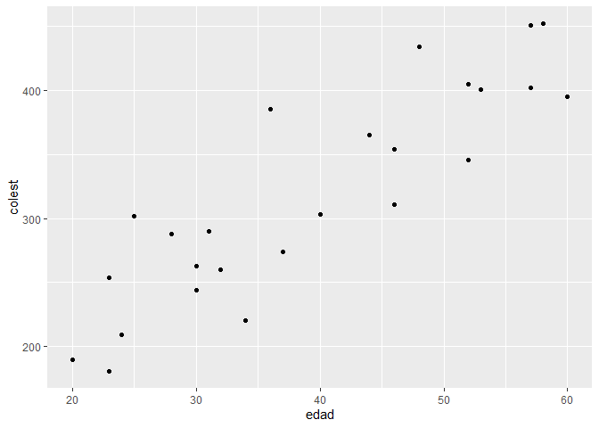
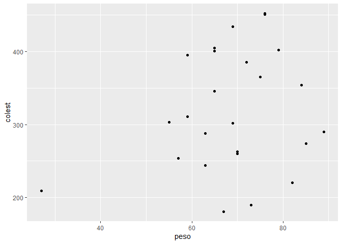
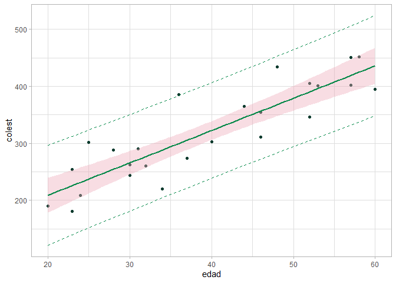
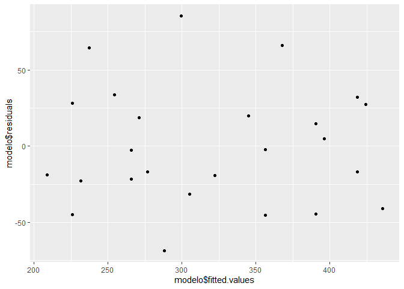

Ejercicio 1.3
================

El archivo peso_edad_colest.xlsx disponible en contiene registros
correspondientes a 25 individuos respecto de su peso, su edad y el nivel
de colesterol total en sangre. Se pide:

1.  Realizar el diagrama de dispersión de colesterol en función de la
    edad y de colesterol en función de peso. Le parece adecuado ajustar
    un modelo lineal para alguno de estos dos pares de variables?

2.  Estime los coeficientes del modelo lineal para el colesterol en
    función de la edad.

3.  Estime intervalos de confianza del 95 % para los coeficientes del
    modelo y compare estos resultados con el test de Wald para los
    coeficientes. Le parece que hay asociación entre estos test y el
    test de la regresión?

4.  A partir de esta recta estime los valores de E(Y ) para x = 25 años
    y x = 48 años. Podría estimarse el valor de E(Y ) para x = 80 años?

5.  Testee la normalidad de los residuos y haga un gráfico para ver si
    son homocedásticos.

``` r
library(readxl)
library(ggplot2)
library(dplyr)
```

    ## 
    ## Attaching package: 'dplyr'

    ## The following objects are masked from 'package:stats':
    ## 
    ##     filter, lag

    ## The following objects are masked from 'package:base':
    ## 
    ##     intersect, setdiff, setequal, union

``` r
library(lmtest)
```

    ## Loading required package: zoo

    ## 
    ## Attaching package: 'zoo'

    ## The following objects are masked from 'package:base':
    ## 
    ##     as.Date, as.Date.numeric

## Cargamos los datos

``` r
datos <- read_excel("C:/Repos/Reg_Av/datasets/peso_edad_colest.xlsx")
head(datos)
```

    ## # A tibble: 6 × 3
    ##    peso  edad colest
    ##   <dbl> <dbl>  <dbl>
    ## 1    84    46    354
    ## 2    73    20    190
    ## 3    65    52    405
    ## 4    70    30    263
    ## 5    76    57    451
    ## 6    69    25    302

## Diagrama de dispersión de colesterol en función de la edad

``` r
ggplot(datos, aes(x = edad, y = colest)) + geom_point()
```

<!-- -->

## Diagrama de dispersión de colesterol en función del peso

``` r
ggplot(datos, aes(x = peso, y = colest)) + geom_point()
```

<!-- -->

## Ajuste de un modelo lineal para el colesterol en función de la edad

``` r
modelo <- lm(colest ~ edad, data = datos)
summary(modelo)
```

    ## 
    ## Call:
    ## lm(formula = colest ~ edad, data = datos)
    ## 
    ## Residuals:
    ##     Min      1Q  Median      3Q     Max 
    ## -68.311 -22.602  -2.627  27.589  85.348 
    ## 
    ## Coefficients:
    ##             Estimate Std. Error t value Pr(>|t|)    
    ## (Intercept)  95.5020    26.2545   3.638  0.00138 ** 
    ## edad          5.6708     0.6345   8.937 6.09e-09 ***
    ## ---
    ## Signif. codes:  0 '***' 0.001 '**' 0.01 '*' 0.05 '.' 0.1 ' ' 1
    ## 
    ## Residual standard error: 39.69 on 23 degrees of freedom
    ## Multiple R-squared:  0.7764, Adjusted R-squared:  0.7667 
    ## F-statistic: 79.87 on 1 and 23 DF,  p-value: 6.094e-09

## Estimación de los coeficientes del modelo lineal para el colesterol en función de la edad

``` r
modelo$coefficients
```

    ## (Intercept)        edad 
    ##   95.502004    5.670842

## Estimación de intervalos de confianza del 95 % para los coeficientes del modelo

``` r
predichos <- predict(modelo, interval = "prediction", level = 0.95)
```

    ## Warning in predict.lm(modelo, interval = "prediction", level = 0.95): predictions on current data refer to _future_ responses

``` r
nuevos_datos=data.frame(datos,predichos)

ggplot(nuevos_datos, aes(x=edad, y=colest)) + geom_point(col='#0B3B2E') +
geom_line(aes(y=lwr), color='#088A4B', linetype='dashed' ) +
geom_line(aes(y=upr), color='#088A4B' , linetype='dashed' ) +
geom_smooth(method=lm, formula=y~x, se=TRUE, level=0.95,col='#088A4B', fill='pink2') +
theme_light()
```

<!-- -->

## Test de Wald para los coeficientes

``` r
waldtest(modelo)
```

    ## Wald test
    ## 
    ## Model 1: colest ~ edad
    ## Model 2: colest ~ 1
    ##   Res.Df Df      F    Pr(>F)    
    ## 1     23                        
    ## 2     24 -1 79.871 6.094e-09 ***
    ## ---
    ## Signif. codes:  0 '***' 0.001 '**' 0.01 '*' 0.05 '.' 0.1 ' ' 1

## Estimación de los valores de E(Y) para x = 25 años y x = 48 años

``` r
newdata <- data.frame(edad = c(25, 48))
predict(modelo, newdata = newdata, interval = "confidence")
```

    ##        fit      lwr      upr
    ## 1 237.2730 212.1954 262.3507
    ## 2 367.7024 347.8058 387.5990

## Test de normalidad de los residuos

``` r
shapiro.test(modelo$residuals)
```

    ## 
    ##  Shapiro-Wilk normality test
    ## 
    ## data:  modelo$residuals
    ## W = 0.96478, p-value = 0.5175

como el p-valor es mayor a 0.05, no se rechaza la hipótesis nula de
normalidad de los residuos. es decir, los residuos siguen una
distribución normal.

## Gráfico de homocedasticidad

``` r
ggplot(datos, aes(x = modelo$fitted.values, y = modelo$residuals)) + geom_point()
```

<!-- --> en el
grafico no se observa un patrón claro, por lo que se puede decir que los
residuos son homocedasticos.
