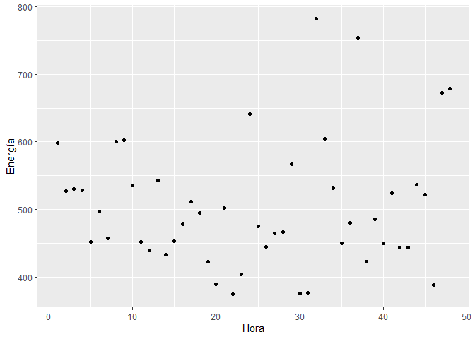
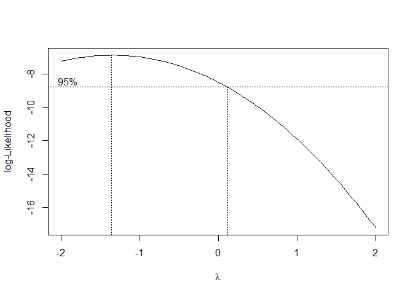

Ejercicio 1.4
================

Una empresa desarrolló un sistema de energía solar para calentar el agua
para una caldera que es parte del sistema de energía del proceso
productivo. Existe el interés de controlar la estabilidad del sistema,
para ello se monitorea el mismo y se registran los datos cada hora. Los
datos se encuentran disponibles en el archivo energia.xlsx

1.  Realizar el diagrama de dispersión y evaluar si un modelo de
    regresión lineal es adecuado.

2.  Estimar un modelo lineal y verificar la normalidad de los residuos
    del mismo.

3.  En caso de rechazar este supuesto buscar una transformación lineal
    para este modelo y aplicarla.

4.  Realizar el análisis diagnóstico del nuevo modelo y estimar un
    intervalo de confianza y un intervalo de predicción para 27.5 hs con
    ambos modelos. Comparar los intervalos.

``` r
library(readxl)
library(ggplot2)
library(dplyr)
```

    ## 
    ## Attaching package: 'dplyr'

    ## The following objects are masked from 'package:stats':
    ## 
    ##     filter, lag

    ## The following objects are masked from 'package:base':
    ## 
    ##     intersect, setdiff, setequal, union

``` r
library(lmtest)
```

    ## Loading required package: zoo

    ## 
    ## Attaching package: 'zoo'

    ## The following objects are masked from 'package:base':
    ## 
    ##     as.Date, as.Date.numeric

``` r
library(MASS)
```

    ## 
    ## Attaching package: 'MASS'

    ## The following object is masked from 'package:dplyr':
    ## 
    ##     select

## Cargamos los datos

``` r
datos <- read_excel("C:/Repos/Reg_Av/datasets/energia.xlsx")
head(datos)
```

    ## # A tibble: 6 × 2
    ##    Hora Energía
    ##   <dbl>   <dbl>
    ## 1     1     598
    ## 2     2     527
    ## 3     3     530
    ## 4     4     528
    ## 5     5     452
    ## 6     6     497

## Diagrama de dispersión

``` r
ggplot(datos, aes(x = Hora, y = Energía)) + geom_point()
```

<!-- -->

En el grafico no se observa una relación lineal entre las variables.

## Modelo lineal

``` r
modelo <- lm(Energía ~ Hora, data = datos)
summary(modelo)
```

    ## 
    ## Call:
    ## lm(formula = Energía ~ Hora, data = datos)
    ## 
    ## Residuals:
    ##     Min      1Q  Median      3Q     Max 
    ## -131.12  -60.60  -24.31   37.29  273.84 
    ## 
    ## Coefficients:
    ##             Estimate Std. Error t value Pr(>|t|)    
    ## (Intercept) 491.4894    27.5044  17.869   <2e-16 ***
    ## Hora          0.5208     0.9772   0.533    0.597    
    ## ---
    ## Signif. codes:  0 '***' 0.001 '**' 0.01 '*' 0.05 '.' 0.1 ' ' 1
    ## 
    ## Residual standard error: 93.79 on 46 degrees of freedom
    ## Multiple R-squared:  0.006138,   Adjusted R-squared:  -0.01547 
    ## F-statistic: 0.2841 on 1 and 46 DF,  p-value: 0.5966

``` r
anova(modelo)
```

    ## Analysis of Variance Table
    ## 
    ## Response: Energía
    ##           Df Sum Sq Mean Sq F value Pr(>F)
    ## Hora       1   2499  2499.0  0.2841 0.5966
    ## Residuals 46 404670  8797.2

el p-valor es de casi 0.6 por lo tanto el modelo no es significativo.

## Normalidad de los residuos

``` r
residuos <- residuals(modelo)
shapiro.test(residuos)
```

    ## 
    ##  Shapiro-Wilk normality test
    ## 
    ## data:  residuos
    ## W = 0.92988, p-value = 0.006752

Como p-value = 0.006752, se rechaza la hipótesis nula de normalidad de
los residuos. para tratar de mejorar esto hacemos la Tranformación de
Box & Cox

## Transformación de Box & Cox

``` r
boxcox(object = modelo, plotit = TRUE)
```

<!-- -->

El gráfico señala que la mejor opción de λ es cercana a -0.5.

``` r
modelo2 <- lm(Energía ^(-0.5) ~ Hora, data = datos)
summary(modelo2)
```

    ## 
    ## Call:
    ## lm(formula = Energía^(-0.5) ~ Hora, data = datos)
    ## 
    ## Residuals:
    ##        Min         1Q     Median         3Q        Max 
    ## -0.0092216 -0.0018093  0.0005564  0.0024291  0.0065797 
    ## 
    ## Coefficients:
    ##               Estimate Std. Error t value Pr(>|t|)    
    ## (Intercept)  4.523e-02  1.134e-03  39.887   <2e-16 ***
    ## Hora        -7.855e-06  4.029e-05  -0.195    0.846    
    ## ---
    ## Signif. codes:  0 '***' 0.001 '**' 0.01 '*' 0.05 '.' 0.1 ' ' 1
    ## 
    ## Residual standard error: 0.003867 on 46 degrees of freedom
    ## Multiple R-squared:  0.0008256,  Adjusted R-squared:  -0.0209 
    ## F-statistic: 0.03801 on 1 and 46 DF,  p-value: 0.8463

``` r
anova(modelo2)
```

    ## Analysis of Variance Table
    ## 
    ## Response: Energía^(-0.5)
    ##           Df     Sum Sq    Mean Sq F value Pr(>F)
    ## Hora       1 0.00000057 5.6840e-07   0.038 0.8463
    ## Residuals 46 0.00068794 1.4955e-05

## Normalidad de los residuos

``` r
residuos2 <- residuals(modelo2)
shapiro.test(residuos2)
```

    ## 
    ##  Shapiro-Wilk normality test
    ## 
    ## data:  residuos2
    ## W = 0.97373, p-value = 0.3513

Como p-value = 0.3499, no se rechaza la hipótesis nula de normalidad de
los residuos.

## Intervalo de confianza y predicción

``` r
confint(modelo, level = 0.95)
```

    ##                 2.5 %     97.5 %
    ## (Intercept) 436.12578 546.852940
    ## Hora         -1.44621   2.487895

``` r
predict(modelo, newdata = data.frame(Hora = 27.5), interval = "prediction", level = 0.95)
```

    ##        fit      lwr      upr
    ## 1 505.8125 314.9688 696.6563

``` r
confint(modelo2, level = 0.95)
```

    ##                     2.5 %       97.5 %
    ## (Intercept)  4.295023e-02 4.751564e-02
    ## Hora        -8.895889e-05 7.324865e-05

``` r
predict(modelo2, newdata = data.frame(Hora = 27.5), interval = "prediction", level = 0.95)
```

    ##          fit        lwr        upr
    ## 1 0.04501692 0.03714822 0.05288562

Los intervalos de confianza y predicción son más estrechos en el modelo
transformado.
